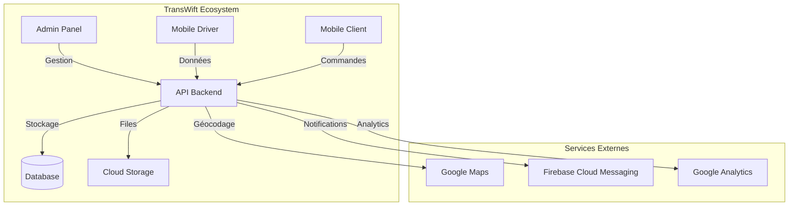

# Architecture TransWift

## Vue d'Ensemble du Système



## Architecture Mobile Driver

### 1. Core Features

#### 1.1 Navigation & Routing
```typescript
/src/navigation/
├── AppNavigator.tsx        // Navigation principale
├── RootNavigation.ts      // Utilitaires de navigation
└── transitions/           // Animations de transition
```

**Fonctionnement :**
- Navigation par pile (Stack)
- Transitions personnalisées
- Gestion deep linking
- État persistant

#### 1.2 State Management
```typescript
/src/store/
├── slices/               // Redux slices
│   ├── delivery.slice.ts
│   ├── auth.slice.ts
│   └── app.slice.ts
└── middleware/          // Middleware personnalisés
```

**Fonctionnement :**
- Redux pour état global
- Persistance locale
- Middleware de synchronisation
- Sélecteurs optimisés

### 2. Fonctionnalités Métier

#### 2.1 Gestion des Livraisons
```typescript
/src/features/delivery/
├── components/          // Composants UI
├── services/           // Logique métier
├── screens/            // Écrans
└── hooks/             // Hooks personnalisés
```

**Workflow :**
1. Réception des livraisons
2. Validation et vérification
3. Capture photos/signature
4. Synchronisation

#### 2.2 Scanner
```typescript
/src/features/scanner/
├── components/
│   ├── QRScanner.tsx
│   └── BarcodeReader.tsx
└── services/
    └── ScannerService.ts
```

**Fonctionnement :**
- Scan QR/codes-barres
- Validation en temps réel
- Mode hors ligne
- Historique des scans

#### 2.3 Reporting
```typescript
/src/features/reporting/
├── components/
│   ├── MetricsCard.tsx
│   └── ReportList.tsx
└── services/
    └── ReportingService.ts
```

**Capacités :**
- Métriques en temps réel
- Rapports personnalisés
- Export multi-formats
- Analyses prédictives

### 3. Services Techniques

#### 3.1 Synchronisation
```typescript
/src/core/sync/
├── SyncManager.ts
├── SyncQueue.ts
└── handlers/
    ├── DeliverySyncHandler.ts
    ├── PhotoSyncHandler.ts
    └── ReportSyncHandler.ts
```

**Stratégie :**
- Queue de synchronisation
- Gestion des conflits
- Retry automatique
- Prioritisation

#### 3.2 Optimisation Batterie
```typescript
/src/services/battery/
├── BatteryOptimizer.ts
├── LocationOptimizer.ts
└── BackgroundTaskManager.ts
```

**Fonctionnalités :**
- Mode économie d'énergie
- Optimisation GPS
- Gestion background
- Monitoring batterie

## Relations Inter-Applications

### 1. Admin Panel → Mobile Driver

**Gestion des Chauffeurs :**
- Attribution des livraisons
- Zones de livraison
- Paramètres chauffeur
- Monitoring en temps réel

**Workflow :**
1. Admin crée/modifie livraison
2. Notification push au chauffeur
3. Mise à jour app chauffeur
4. Synchronisation données

### 2. Mobile Driver → Admin Panel

**Reporting :**
- Statut des livraisons
- Position GPS
- Photos/Signatures
- Incidents/Retards

**Synchronisation :**
1. Capture données offline
2. Queue de synchronisation
3. Upload vers backend
4. Mise à jour admin panel

### 3. Mobile Client → Mobile Driver

**Communication :**
- Statut livraison
- ETA
- Notes spéciales
- Feedback

## Sécurité & Performance

### 1. Sécurité
- JWT Authentication
- Chiffrement données
- Validation inputs
- Audit logs

### 2. Performance
- Lazy loading
- Cache intelligent
- Compression données
- Optimisation assets

## Monitoring & Analytics

### 1. Métriques Clés
- Taux de livraison
- Temps moyen
- Satisfaction client
- Performance app

### 2. Alertes
- Retards
- Erreurs
- Batterie faible
- Problèmes sync

## Documentation & Support

### 1. Documentation
- Guide utilisateur
- Documentation API
- Guides déploiement
- Troubleshooting

### 2. Support
- Chat support
- Base connaissance
- Formation
- Updates réguliers
